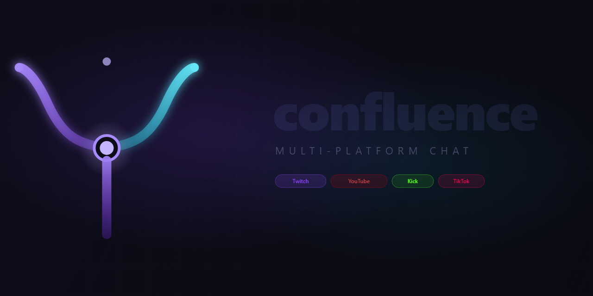

<p align="center">
  
</p>

<p align="center">
  
  
  
  
</p>

<p align="center">
  <strong>All your chats. One window.</strong><br />
  A free, open-source multi-platform chat aggregator built for streamers.
</p>

---

## What is Confluence?

Confluence is a **desktop chat client** that pulls together your Twitch, YouTube, Kick, and TikTok live chats into a single, highly customizable window — so you never have to tab between browser dashboards again.

Built for streamers who multistream, have large communities, or simply want a cleaner, faster chat experience than what browser-based dashboards offer.

**It's completely free and open source.**

> Already managing multiple chat windows? There's a better way to manage your **stream** itself too — see [AntiSnipe](#-take-control-of-your-stream-with-antisnipe) at the bottom.

---

## Features

### Multi-Platform Chat — One Window

| Platform | Chat | OAuth Login | Send Messages | Notes |
|----------|------|-------------|---------------|-------|
| Twitch   | ✓    | ✓           | ✓             | Full IRC, mod actions, badges |
| YouTube  | ✓    | ✓           | ✓             | Auto-connects when you go live |
| Kick     | ✓    | —           | —             | Public WebSocket, no login needed |
| TikTok   | ✓    | —           | —             | Live chat + gifts, no login needed |

Add unlimited channels across any platform. Switch between them with tabs, or view all chats merged into a single **All** feed. Right-click any tab to **rename**, **change channel**, or **remove** it.

### Third-Party Emotes

Full support for the emote providers your community uses:

- **7TV** — global and per-channel emotes, animated WebP, badges, and username paints
- **BetterTTV (BTTV)** — global and channel emotes, GIF support
- **FrankerFaceZ (FFZ)** — global and channel emotes

Hover any emote to see its name, provider, and a large preview. Emotes are fetched and cached on first connect. Messages already on screen are **retroactively updated** when the emote pack finishes loading — so even the initial burst of chat that arrives before emotes load will have emotes rendered correctly once they're ready.

### Mod Actions (Twitch)

If you're a moderator or broadcaster, action buttons appear on hover for each message:

- **Delete** — remove a single message
- **Timeout** — quick-select presets (1m, 10m, 1h, 1d, or custom)
- **Ban** — permanent ban

Mod commands are routed through the Twitch Helix API — not IRC — so they work reliably regardless of IRC deprecations. You can also type `/ban`, `/timeout`, `/unban` directly in the chat input and they'll be intercepted and executed via the API.

### @ Mention Autocomplete

Start typing `@` in the chat input and a suggestion dropdown appears, populated from the most recent 500 chatters in that channel. Navigate with arrow keys, select with Tab or Enter.

### Reply Context

When a chatter replies to someone, the original message is shown as a quoted bar directly above the reply. Replies directed at you are highlighted in gold so they stand out instantly.

### Platform Icons

Each message displays the source platform's icon inline (Twitch, YouTube, Kick, TikTok) so you can instantly tell which platform a message came from in a merged feed.

### Mentions and Alerts

- Highlight messages containing custom keywords
- Flash the taskbar on mention (configurable)
- Separate mention detection from general keyword alerts

### Keyboard Shortcuts

| Shortcut | Action |
|----------|--------|
| `Ctrl + =` / `Ctrl + +` | Zoom in (increase font size) |
| `Ctrl + -` | Zoom out (decrease font size) |
| `Ctrl + 0` | Reset zoom |
| `Ctrl + ,` | Open Settings |
| `Escape` | Close modals / panels |

### Emote Animation Control

Control when animated emotes (GIFs / animated WebP) play:

- **Always** — always animate
- **Focused only** — pause animations when the window is in the background
- **Never** — always show static images

### Own Messages

When you send a message on Twitch, it appears in chat immediately — no waiting for the IRC echo round-trip. If the echo arrives before the 10-second window expires, it is silently dropped to prevent duplicates.

### Chat History

When you join a Twitch channel, the last 100 messages are fetched from the [recent-messages API](https://recent-messages.robotty.de/) and displayed greyed out so you can tell which messages are historical at a glance.

### Auto-Updates

Confluence checks for updates in the background and notifies you with a banner when one is ready. Updates are downloaded automatically — click **Restart & Install** to apply, or install later from Settings → General → Updates.

### Performance

- Render-windowed message list (last 200 messages rendered, block-flow layout) — no layout overlap ever
- Configurable message limit per channel (100–50,000)
- Disk-cached emotes — subsequent connects load from disk in under a second
- Auto-reconnect on disconnect

---

## Installation

### Download a Release

Head to the [Releases](https://github.com/Antiparty/AntiSnipe-MultiChat/releases) page and download the installer for your platform:

| Platform | File |
|----------|------|
| Windows  | `Confluence-Setup-x.x.x.exe` |
| macOS    | `Confluence-x.x.x.dmg` |
| Linux    | `Confluence-x.x.x.AppImage` |

### Build from Source

**Prerequisites:** Node.js 20+ · npm 9+ · Git

```bash
git clone https://github.com/Antiparty/AntiSnipe-MultiChat.git
cd AntiSnipe-MultiChat
npm install

# Development (hot reload)
npm run dev

# Production builds
npm run package:win    # Windows NSIS installer
npm run package:mac    # macOS DMG
npm run package:linux  # AppImage + .deb
```

---

## Setup Guide

### Adding a Channel

1. Click the **+** button in the tab bar
2. Select your platform
3. Enter the channel identifier (see platform notes below)
4. Click **Add Channel**

Right-click any tab at any time to **rename**, **change channel**, or **remove** it. Right-click the live viewer count in the header to **clear chat** locally.

#### Twitch
Enter the channel name (e.g. `xqc`). No login required to read chat. Log in via Settings → Auth to send messages and see mod actions.

#### YouTube
Enter your channel handle (e.g. `@yourname`) or paste a video/stream URL. Confluence will automatically connect when you go live — no need to start your stream first. Log in via Settings → Auth to send messages.

#### Kick
Enter the channel slug (e.g. `xqc`). No login required. Chat is read via Kick's public Pusher WebSocket.

#### TikTok
Enter the username without `@` (e.g. `username`). The streamer must be live. Chat messages and gifts are received in real time with no authentication required.

---

## Auth Setup

### Twitch

1. Go to [dev.twitch.tv/console](https://dev.twitch.tv/console) and log in
2. Click **Register Your Application**
3. Set **OAuth Redirect URL** to `http://localhost:47891/auth/twitch`
4. Set **Category** to **Chat Bot** and click **Create**
5. Click **Manage → New Secret** and copy both **Client ID** and **Client Secret**
6. In Confluence: **Settings → Auth → Twitch**, paste both values and click **Connect**

### YouTube

1. Go to [console.cloud.google.com](https://console.cloud.google.com)
2. Create a project, then go to **APIs & Services → Credentials**
3. Click **Create Credentials → OAuth client ID**, type: **Desktop app**
4. Add `http://localhost:47891/auth/youtube` as an authorized redirect URI
5. Enable **YouTube Data API v3** in the API Library
6. Copy both the **Client ID** and **Client Secret**
7. In Confluence: **Settings → Auth → YouTube**, paste both values and click **Connect**

> **Quota note:** YouTube's free daily API quota covers approximately 5–6 hours of live chat polling. For heavier use, request a quota increase in Google Cloud Console.

---

## Settings Reference

Open Settings with `Ctrl + ,` or the gear icon.

### Appearance

| Setting | Options | Default | Description |
|---------|---------|---------|-------------|
| Theme | Dark / Light / System | Dark | App color scheme |
| Font Size | 10–22px | 14px | Base text size (`Ctrl +/-` also works) |
| Message Spacing | Compact / Normal / Cozy | Normal | Vertical padding between messages |
| Alternating Rows | On / Off | Off | Subtle zebra-striping |
| Timestamps | On / Off | On | Show time next to each message |
| Timestamp Format | 24h / 12h | 24h | Clock format |
| Badges | On / Off | On | Subscriber, mod, and platform badges |
| Platform Icon | On / Off | On | Platform icon next to each message |
| Username Display | Display / Login / Both | Display | Which name variant to render |
| Deleted Messages | Strike / Hide | Strike | How timed-out messages appear |

### Behavior

| Setting | Options | Default | Description |
|---------|---------|---------|-------------|
| Pause Scroll on Hover | On / Off | Off | Freeze auto-scroll when hovering |
| Smooth Scroll | On / Off | Off | Glide to new messages instead of jumping |
| Show Reply Context | On / Off | On | Quoted bar above reply messages |
| Connection Alerts | On / Off | On | Connect/disconnect system messages |
| Flash on Mention | On / Off | On | Taskbar flash when your name is mentioned |
| Hide Commands | On / Off | Off | Filter messages starting with `/` or `!` |
| Max Messages Per Channel | 100–50,000 | 5,000 | Message retention cap |

### Emotes

| Setting | Options | Default | Description |
|---------|---------|---------|-------------|
| 7TV | On / Off | On | 7TV global and channel emotes |
| BTTV | On / Off | On | BetterTTV emotes |
| FFZ | On / Off | On | FrankerFaceZ emotes |
| 7TV Badges | On / Off | On | Show 7TV badges next to usernames |
| 7TV Paints | On / Off | On | Animated gradient username colors from 7TV |
| Emote Scale | 0.5× – 3× | 1.5× | Emote size relative to font |
| Animation | Always / Focused / Never | Always | When animated emotes play |

### Mod Actions (Twitch)

| Setting | Description |
|---------|-------------|
| Show Delete button | Toggle the trash icon on messages |
| Show Timeout button | Toggle the clock icon with duration presets |
| Show Ban button | Toggle the ban icon |
| Timeout Presets | Add/remove duration presets (e.g. `10m`, `1h`, `7d`) |

---

## Architecture

```
src/
├── main/               Electron main process (Node.js)
│   ├── services/
│   │   ├── twitch/     IRC WebSocket, message normalizer, badge resolver
│   │   ├── youtube/    Data API v3 polling, OAuth client, offline retry loop
│   │   ├── kick/       Pusher WebSocket
│   │   └── tiktok/     tiktok-live-connector, gift/sub normalizer
│   ├── emotes/         7TV / BTTV / FFZ fetch, disk cache, resolver
│   ├── auth/           OAuth PKCE (Twitch + YouTube), TokenStore
│   ├── ipc/            Typed IPC bridge + rate-limited message broadcaster
│   └── store/          electron-store settings persistence + Zod validation
├── renderer/           React 18 frontend
│   ├── store/          Zustand 5 + immer + IPC sync middleware
│   ├── components/
│   │   ├── chat/       Message list, MessageRow, ChatInput, ChatTabs, UserCard
│   │   ├── settings/   Auth, appearance, emotes, filters, mod buttons
│   │   └── ui/         Button, Input, Tooltip, PlatformLogos
│   └── hooks/          useSettings, useChat
└── shared/             Types shared between main and renderer
    ├── types/          message, channel, emote, settings, ipc
    └── constants.ts
```

The main process owns all platform connections. Messages are batched and broadcast to the renderer via a typed IPC bridge at 30fps. Emote packs are fetched and cached on disk, then pushed via `EMOTE_BATCH_READY` — the renderer retokenizes existing messages so nothing is missed.

---

## Contributing

Contributions are welcome! See **[CONTRIBUTING.md](CONTRIBUTING.md)** for the full guide — how to set up the project, the architecture, code conventions, and the PR checklist.

The short version:

1. Fork the repo and create a branch: `git checkout -b feature/my-feature`
2. Make your changes: `npm run typecheck && npm run lint`
3. Open a pull request with a clear description

For larger features or new platform integrations, open an issue first to discuss the approach.

---

## Roadmap

- [ ] YouTube send messages
- [ ] Kick send messages
- [ ] Per-channel custom keyword alert rules
- [ ] Custom username color overrides
- [ ] Regex-based chat filters
- [ ] Log export (JSON / CSV)
- [ ] Pronouns support
- [ ] Resizable multi-column layout
- [ ] TikTok OAuth for sending messages

---

## License

MIT — see [LICENSE](LICENSE) for details.

---

## Take Control of Your Stream with AntiSnipe

You're already managing your chat like a pro. Now take the same level of control over your **stream itself**.

---

### The Problem Every Competitive Streamer Knows

Stream snipers join your game using your own broadcast against you. Your only real defense is stream delay — but every platform makes this painful:

- Twitch's delay options are fixed presets
- YouTube has no mid-stream delay adjustment
- **Any delay change on any platform requires ending your stream, losing your VOD continuity, and restarting your encoder**

You're forced to choose between protecting yourself and maintaining stream quality.

### AntiSnipe: Dynamic Delay Without Ending Your Stream

**AntiSnipe** is a local RTMP proxy that runs on your machine, between your encoder (OBS, Streamlabs, etc.) and your streaming destinations. It buffers your stream locally and gives you **real-time delay control without any restarts**.

```
OBS / Encoder
      │
      ▼
 AntiSnipe (local)  ──▶  Twitch   (with delay)
      │              ──▶  YouTube  (with delay)
      │              ──▶  Kick     (with delay)
      └──────────────────────────────────────────
              One encoder output. All platforms.
              Delay adjustable live. No restarts.
```

### What You Can Do

| Scenario | Without AntiSnipe | With AntiSnipe |
|----------|-------------------|----------------|
| Add delay mid-stream | End stream → change settings → restart | Drag the delay slider |
| Reduce delay post-game | End stream → change settings → restart | Drag the delay slider |
| Multistream (RTMP) | Pay for a relay service or use multiple encoder outputs | One output, all platforms |
| Emergency sniper response | Nothing | +5 minutes of delay, instantly |

### Why Local?

AntiSnipe runs entirely on your own hardware:

- **No middleman servers** — your stream goes machine → platform, not through someone else's infrastructure
- **No latency penalty** — buffering is local RAM/disk, not a transatlantic hop
- **Your stream, your control**

### Get AntiSnipe

> **[antisnipe.com](https://antisnipe.com)**

Confluence is free and open source. AntiSnipe is a paid product — built for streamers who need a professional-grade solution and want it to just work. Use Confluence to stay on top of your community. Use AntiSnipe to stay one step ahead of everyone else.

---

<p align="center">
  Made for the streaming community.<br />
  <a href="https://antisnipe.com">AntiSnipe</a> &nbsp;·&nbsp;
  <a href="https://github.com/Antiparty/AntiSnipe-MultiChat/issues">Report an Issue</a> &nbsp;·&nbsp;
  <a href="https://github.com/Antiparty/AntiSnipe-MultiChat/releases">Download</a>
</p>
